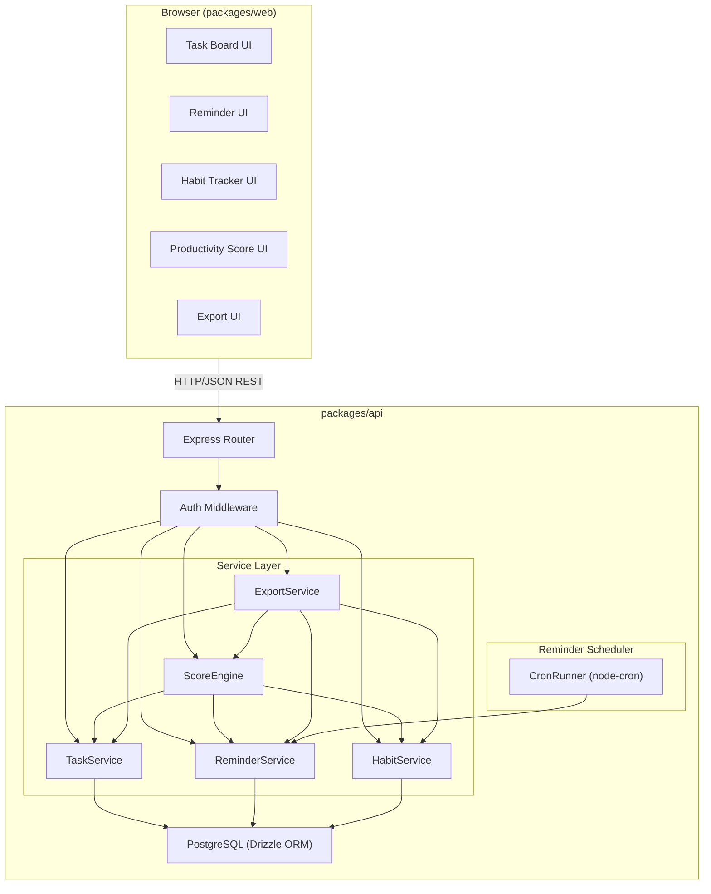
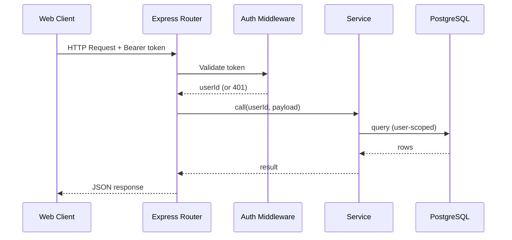
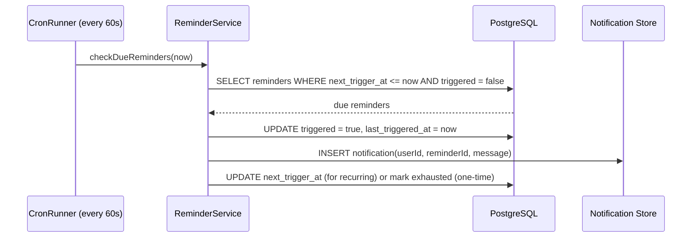

# Design Document — DailyFlow

## Overview

DailyFlow is a personal productivity application that unifies four modules — Task Board, Reminder Engine, Habit Tracker, and Productivity Score — into a single experience anchored to a shared User entity. All user data is private, scoped by user identity, and the application exposes a RESTful JSON API consumed by a React web client.

The system is structured as an **npm monorepo** with two packages:

- `packages/api` — Node.js/TypeScript REST API (Express + PostgreSQL)
- `packages/web` — React/TypeScript single-page application

### Technology Stack

| Layer | Choice | Rationale |
|---|---|---|
| API runtime | Node.js 20 LTS + TypeScript | Strong ecosystem, type safety across full stack, good async I/O for reminders |
| API framework | Express 5 | Minimal, well-understood, easy to layer middleware for auth and validation |
| Database | PostgreSQL 16 | Relational integrity for user-scoped data, `DATE` type for streak calculations, JSONB for export flexibility |
| ORM / query builder | Drizzle ORM | Type-safe SQL, schema-as-code, lightweight migrations |
| Validation | Zod | Schema-first validation that doubles as TypeScript type inference |
| Scheduling | node-cron | Cron-style in-process scheduler for reminder triggering; production deployments can swap to BullMQ |
| Web framework | React 18 + TypeScript | Component model maps naturally to the Kanban board and habit grid |
| Web state | TanStack Query (React Query) | Server-state caching and invalidation; avoids over-fetching |
| Web routing | React Router v6 | Client-side navigation between modules |
| Testing (API) | Vitest + fast-check | Vitest for unit/integration; fast-check for property-based tests |
| Testing (Web) | Vitest + Testing Library | Component and interaction tests |

---

## Architecture

### System Component Diagram



### Request Data Flow



### Reminder Scheduling Data Flow



---

## Components and Interfaces

### Auth Middleware

Validates the `Authorization: Bearer <token>` header on every request. Extracts and attaches `userId` to `req.user`. Returns `401 Unauthorized` for missing or invalid tokens.

```typescript
interface AuthenticatedRequest extends Request {
  user: { id: string };
}
```

### TaskService

Responsible for CRUD operations on Tasks and computing `Task_Completion_Rate`.

```typescript
interface TaskService {
  createTask(userId: string, input: CreateTaskInput): Promise<Task>;
  getTask(userId: string, taskId: string): Promise<Task>;
  updateTaskStatus(userId: string, taskId: string, status: TaskStatus): Promise<Task>;
  getBoardForUser(userId: string): Promise<TaskBoard>;
  getCompletionRate(userId: string): Promise<number>;  // [0, 1]
}
```

### ReminderService

Handles reminder lifecycle: creation, schedule storage, trigger execution, and acknowledgement.

```typescript
interface ReminderService {
  createReminder(userId: string, input: CreateReminderInput): Promise<Reminder>;
  acknowledgeReminder(userId: string, reminderId: string): Promise<Reminder>;
  getRemindersForUser(userId: string): Promise<Reminder[]>;
  checkAndTriggerDue(now: Date): Promise<void>;          // called by CronRunner
  getAcknowledgementRate(userId: string): Promise<number>; // [0, 1]
}
```

### HabitService

Manages habit creation, completion recording, and streak calculation.

```typescript
interface HabitService {
  createHabit(userId: string, input: CreateHabitInput): Promise<Habit>;
  recordCompletion(userId: string, habitId: string, date: CalendarDate): Promise<CompletionRecord>;
  getHabit(userId: string, habitId: string): Promise<HabitWithStreak>;
  getHabitsForUser(userId: string): Promise<HabitWithStreak[]>;
  calculateStreak(habitId: string, asOfDate: CalendarDate): Promise<number>;
  getStreakConsistency(userId: string): Promise<number>;  // [0, 1]
}
```

### ScoreEngine

A pure computation layer — reads from other services and applies the weighted formula.

```typescript
interface ScoreEngine {
  computeScore(userId: string): Promise<ProductivityScore>;
  computeTaskCompletionRate(userId: string): Promise<number>;
  computeReminderAcknowledgementRate(userId: string): Promise<number>;
  computeHabitStreakConsistency(userId: string): Promise<number>;
}
```

### ExportService

Assembles and serialises the full `Export_Payload` atomically.

```typescript
interface ExportService {
  exportUserData(userId: string): Promise<ExportPayload>;
}
```

---

## Data Models

### TypeScript Interfaces

```typescript
// Shared primitive
type CalendarDate = string; // ISO 8601 date: "YYYY-MM-DD"
type ISOTimestamp = string;  // ISO 8601 datetime: "YYYY-MM-DDTHH:mm:ssZ"

// ─── User ───────────────────────────────────────────────────────────────────
interface User {
  id: string;               // UUID v4
  email: string;
  displayName: string;
  createdAt: ISOTimestamp;
  timezone: string;         // IANA timezone string, e.g. "America/New_York"
}

// ─── Task ────────────────────────────────────────────────────────────────────
type TaskStatus = 'Todo' | 'In_Progress' | 'Done';

interface Task {
  id: string;               // UUID v4
  userId: string;
  title: string;            // 1–255 chars
  description: string | null; // 0–2000 chars
  status: TaskStatus;
  createdAt: ISOTimestamp;
  updatedAt: ISOTimestamp;
}

interface CreateTaskInput {
  title: string;
  description?: string;
}

interface TaskBoard {
  Todo: Task[];
  In_Progress: Task[];
  Done: Task[];
}

// ─── Reminder ─────────────────────────────────────────────────────────────────
type ReminderState = 'pending' | 'triggered' | 'acknowledged';

interface OneTimeSchedule {
  type: 'one_time';
  triggerAt: ISOTimestamp;  // stored with minute precision
}

interface DailySchedule {
  type: 'daily';
  timeOfDay: string;        // "HH:MM" in 24h format, 00:00–23:59
}

interface WeeklySchedule {
  type: 'weekly';
  daysOfWeek: DayOfWeek[];  // at least one entry
  timeOfDay: string;        // "HH:MM" in 24h format
}

type DayOfWeek = 'Monday' | 'Tuesday' | 'Wednesday' | 'Thursday' | 'Friday' | 'Saturday' | 'Sunday';
type ReminderSchedule = OneTimeSchedule | DailySchedule | WeeklySchedule;

interface Reminder {
  id: string;               // UUID v4
  userId: string;
  title: string;            // 1–200 chars
  schedule: ReminderSchedule;
  state: ReminderState;
  nextTriggerAt: ISOTimestamp | null;  // null for exhausted one-time
  lastTriggeredAt: ISOTimestamp | null;
  createdAt: ISOTimestamp;
}

interface CreateReminderInput {
  title: string;
  schedule: ReminderSchedule;
}

// ─── Habit ────────────────────────────────────────────────────────────────────
interface Habit {
  id: string;               // UUID v4
  userId: string;
  name: string;             // 1–200 chars
  createdAt: ISOTimestamp;
}

interface HabitWithStreak extends Habit {
  streak: number;           // current consecutive streak (>= 0)
}

interface CompletionRecord {
  id: string;               // UUID v4
  habitId: string;
  userId: string;
  date: CalendarDate;       // "YYYY-MM-DD"
}

interface CreateHabitInput {
  name: string;
}

// ─── Productivity Score ───────────────────────────────────────────────────────
interface ProductivityScore {
  score: number;            // [0, 100], rounded to 2 decimal places
  taskCompletionRate: number;           // [0, 1]
  reminderAcknowledgementRate: number;  // [0, 1]
  habitStreakConsistency: number;       // [0, 1]
  calculatedAt: ISOTimestamp;
  scoringWindowDate: CalendarDate;
}

// ─── Export ───────────────────────────────────────────────────────────────────
interface ExportPayload {
  exportedAt: ISOTimestamp;
  userId: string;
  tasks: Task[];
  reminders: Reminder[];
  habits: HabitWithStreak[];
  productivityScore: ProductivityScore;
}
```

### Database Schema

```sql
-- ─── users ────────────────────────────────────────────────────────────────────
CREATE TABLE users (
  id          UUID PRIMARY KEY DEFAULT gen_random_uuid(),
  email       TEXT NOT NULL UNIQUE,
  display_name TEXT NOT NULL,
  timezone    TEXT NOT NULL DEFAULT 'UTC',
  created_at  TIMESTAMPTZ NOT NULL DEFAULT now()
);

-- ─── tasks ────────────────────────────────────────────────────────────────────
CREATE TYPE task_status AS ENUM ('Todo', 'In_Progress', 'Done');

CREATE TABLE tasks (
  id          UUID PRIMARY KEY DEFAULT gen_random_uuid(),
  user_id     UUID NOT NULL REFERENCES users(id) ON DELETE CASCADE,
  title       TEXT NOT NULL CHECK (char_length(title) BETWEEN 1 AND 255),
  description TEXT CHECK (description IS NULL OR char_length(description) <= 2000),
  status      task_status NOT NULL DEFAULT 'Todo',
  created_at  TIMESTAMPTZ NOT NULL DEFAULT now(),
  updated_at  TIMESTAMPTZ NOT NULL DEFAULT now()
);

CREATE INDEX idx_tasks_user_id ON tasks(user_id);
CREATE INDEX idx_tasks_user_status ON tasks(user_id, status);

-- ─── reminders ────────────────────────────────────────────────────────────────
CREATE TYPE reminder_state AS ENUM ('pending', 'triggered', 'acknowledged');
CREATE TYPE schedule_type  AS ENUM ('one_time', 'daily', 'weekly');

CREATE TABLE reminders (
  id               UUID PRIMARY KEY DEFAULT gen_random_uuid(),
  user_id          UUID NOT NULL REFERENCES users(id) ON DELETE CASCADE,
  title            TEXT NOT NULL CHECK (char_length(title) BETWEEN 1 AND 200),
  state            reminder_state NOT NULL DEFAULT 'pending',
  schedule_type    schedule_type NOT NULL,
  -- one_time fields
  trigger_at       TIMESTAMPTZ,          -- rounded to minute
  -- daily/weekly fields
  time_of_day      TIME,                 -- HH:MM
  days_of_week     TEXT[],               -- e.g. {'Monday','Wednesday'}
  -- scheduler state
  next_trigger_at  TIMESTAMPTZ,
  last_triggered_at TIMESTAMPTZ,
  created_at       TIMESTAMPTZ NOT NULL DEFAULT now()
);

CREATE INDEX idx_reminders_user_id ON reminders(user_id);
CREATE INDEX idx_reminders_next_trigger ON reminders(next_trigger_at)
  WHERE next_trigger_at IS NOT NULL;

-- ─── habits ───────────────────────────────────────────────────────────────────
CREATE TABLE habits (
  id          UUID PRIMARY KEY DEFAULT gen_random_uuid(),
  user_id     UUID NOT NULL REFERENCES users(id) ON DELETE CASCADE,
  name        TEXT NOT NULL CHECK (char_length(name) BETWEEN 1 AND 200),
  created_at  TIMESTAMPTZ NOT NULL DEFAULT now()
);

CREATE INDEX idx_habits_user_id ON habits(user_id);

-- ─── completion_records ────────────────────────────────────────────────────────
CREATE TABLE completion_records (
  id         UUID PRIMARY KEY DEFAULT gen_random_uuid(),
  habit_id   UUID NOT NULL REFERENCES habits(id) ON DELETE CASCADE,
  user_id    UUID NOT NULL REFERENCES users(id) ON DELETE CASCADE,
  date       DATE NOT NULL
);

-- Enforce uniqueness: one record per habit per user per day (Req 11.2 idempotence)
CREATE UNIQUE INDEX idx_completion_habit_user_date
  ON completion_records(habit_id, user_id, date);

CREATE INDEX idx_completion_habit_id ON completion_records(habit_id);
```

---

## Algorithm Pseudocode

### Streak Calculation (Requirement 12)

```
function calculateStreak(habitId: string, asOfDate: CalendarDate): number
  records ← SELECT DISTINCT date FROM completion_records
              WHERE habit_id = habitId
              ORDER BY date DESC

  IF records is empty THEN
    RETURN 0

  mostRecentDate ← records[0]
  yesterday      ← asOfDate - 1 day

  -- Staleness check: if most recent completion is older than yesterday, streak is 0
  IF mostRecentDate < yesterday THEN
    RETURN 0

  -- Walk backwards through consecutive dates
  streak ← 0
  expectedDate ← mostRecentDate

  FOR EACH date IN records DO
    IF date == expectedDate THEN
      streak ← streak + 1
      expectedDate ← expectedDate - 1 day
    ELSE IF date < expectedDate THEN
      -- Gap found; stop counting
      BREAK
    -- date > expectedDate means duplicate (already deduplicated by DISTINCT), skip

  RETURN streak
```

> The `DISTINCT` in the query and the `UNIQUE INDEX` on `(habit_id, user_id, date)` together implement Requirement 12.5 (duplicate dates count as one) and Requirement 11.2 (idempotent completion recording).

### Habit Streak Consistency Normalisation (Requirement 16)

```
SCORING_WINDOW_DAYS = 30

function computeHabitStreakConsistency(userId: string, asOfDate: CalendarDate): number
  habits ← getHabitsForUser(userId)

  IF habits is empty THEN
    RETURN 0   -- Req 16.2

  cappedStreaks ← []
  FOR EACH habit IN habits DO
    streak ← calculateStreak(habit.id, asOfDate)
    cappedStreak ← min(streak, SCORING_WINDOW_DAYS)   -- Req 16.4
    cappedStreaks.append(cappedStreak)

  meanStreak ← sum(cappedStreaks) / len(cappedStreaks)
  consistency ← meanStreak / SCORING_WINDOW_DAYS      -- normalise to [0, 1]

  RETURN consistency  -- guaranteed in [0, 1] since each element in [0, 30]
```

### Productivity Score Calculation (Requirement 13)

```
function computeProductivityScore(userId: string): ProductivityScore
  tcr  ← computeTaskCompletionRate(userId)        -- [0, 1]
  rar  ← computeReminderAcknowledgementRate(userId) -- [0, 1]
  hsc  ← computeHabitStreakConsistency(userId)     -- [0, 1]

  rawScore ← (tcr × 0.4 + rar × 0.3 + hsc × 0.3) × 100

  -- Clamp to [0, 100] as a defensive guard (Req 13.8)
  clampedScore ← max(0, min(100, rawScore))

  -- Round to 2 decimal places (Req 13.2)
  finalScore ← round(clampedScore, 2)

  RETURN { score: finalScore, taskCompletionRate: tcr,
           reminderAcknowledgementRate: rar, habitStreakConsistency: hsc,
           calculatedAt: now(), scoringWindowDate: today() }
```

### Task Completion Rate (Requirement 14)

```
function computeTaskCompletionRate(userId: string): number
  tasks ← SELECT status FROM tasks WHERE user_id = userId

  total ← count of tasks WHERE status IN ('Todo', 'In_Progress', 'Done')

  IF total == 0 THEN
    RETURN 0   -- Req 14.2

  done ← count of tasks WHERE status = 'Done'
  RETURN round(done / total, 4)   -- [0, 1]
```

### Reminder Acknowledgement Rate (Requirement 15)

```
SCORING_WINDOW = today() in user's local timezone

function computeReminderAcknowledgementRate(userId: string): number
  dueReminders ← SELECT state FROM reminders
                  WHERE user_id = userId
                    AND next_trigger_at <= end_of(SCORING_WINDOW)
                     OR last_triggered_at <= end_of(SCORING_WINDOW)

  total ← count(dueReminders)

  IF total == 0 THEN
    RETURN 0   -- Req 15.2

  acknowledged ← count of dueReminders WHERE state = 'acknowledged'
  rate ← round(acknowledged / total, 4)

  -- Defensive guard (Req 15.5)
  IF rate < 0 OR rate > 1 THEN
    THROW InvalidRateError("Acknowledgement rate out of bounds")

  RETURN rate
```

### Reminder Scheduling and At-Most-Once Enforcement (Requirements 6–8)

```
-- Called by CronRunner every 60 seconds
function checkAndTriggerDue(now: Date): void
  -- Fetch all reminders whose next_trigger_at is within the past 60-second window
  due ← SELECT * FROM reminders
         WHERE next_trigger_at >= (now - 60s)
           AND next_trigger_at <= now
           AND state != 'acknowledged'

  FOR EACH reminder IN due DO
    -- Atomic update to prevent double-trigger on concurrent runs
    updated ← UPDATE reminders
               SET state = 'triggered',
                   last_triggered_at = now,
                   next_trigger_at = computeNextTrigger(reminder, now)
               WHERE id = reminder.id
                 AND (last_triggered_at IS NULL
                      OR last_triggered_at < startOfDay(now))  -- at-most-once guard
               RETURNING id

    IF updated is not empty THEN
      INSERT INTO notifications(user_id, reminder_id, message, created_at)
      VALUES (reminder.userId, reminder.id, reminder.title, now)

function computeNextTrigger(reminder: Reminder, triggeredAt: Date): Date | null
  MATCH reminder.schedule_type:
    CASE 'one_time':
      RETURN null   -- exhausted

    CASE 'daily':
      RETURN nextOccurrenceOfTime(reminder.time_of_day, triggeredAt + 1 day)

    CASE 'weekly':
      nextDay ← nextMatchingWeekday(reminder.days_of_week, triggeredAt + 1 day)
      RETURN nextOccurrenceOfTime(reminder.time_of_day, nextDay)
```

> The `WHERE last_triggered_at < startOfDay(now)` guard enforces Requirement 7.4 (daily: at most once per calendar day) and Requirement 8.3 (weekly: at most once per weekday per calendar week) within a single atomic `UPDATE`.

---

## API Endpoint Specifications

All endpoints are prefixed with `/api/v1`. All requests require `Authorization: Bearer <token>` unless noted. All responses are `application/json`.

### User / Auth

| Method | Path | Description |
|---|---|---|
| `POST` | `/auth/register` | Create user account |
| `POST` | `/auth/login` | Authenticate and receive token |

**POST /auth/register**
```
Request:  { email: string, password: string, displayName: string, timezone?: string }
Response 201: { user: User, token: string }
Response 400: { error: "VALIDATION_ERROR", details: string[] }
Response 409: { error: "EMAIL_ALREADY_EXISTS" }
```

**POST /auth/login**
```
Request:  { email: string, password: string }
Response 200: { user: User, token: string }
Response 401: { error: "INVALID_CREDENTIALS" }
```

---

### Tasks

| Method | Path | Description |
|---|---|---|
| `POST` | `/tasks` | Create a task |
| `GET` | `/tasks/board` | Get Kanban board (all tasks grouped by status) |
| `GET` | `/tasks/:id` | Get a single task |
| `PATCH` | `/tasks/:id/status` | Update task status |

**POST /tasks**
```
Request:  { title: string, description?: string }
Response 201: Task
Response 400: { error: "VALIDATION_ERROR", field: "title"|"description", message: string }
Response 401: { error: "UNAUTHORIZED" }
```

**GET /tasks/board**
```
Response 200: { Todo: Task[], In_Progress: Task[], Done: Task[] }
Response 401: { error: "UNAUTHORIZED" }
```

**PATCH /tasks/:id/status**
```
Request:  { status: "Todo" | "In_Progress" | "Done" }
Response 200: Task
Response 400: { error: "VALIDATION_ERROR", message: "Invalid status value" }
Response 401: { error: "UNAUTHORIZED" }
Response 404: { error: "NOT_FOUND" }
```

---

### Reminders

| Method | Path | Description |
|---|---|---|
| `POST` | `/reminders` | Create a reminder |
| `GET` | `/reminders` | List all reminders for user |
| `GET` | `/reminders/:id` | Get a single reminder |
| `POST` | `/reminders/:id/acknowledge` | Acknowledge a reminder |

**POST /reminders**
```
Request:
  {
    title: string,
    schedule:
      | { type: "one_time", triggerAt: string }          // ISO 8601
      | { type: "daily", timeOfDay: string }             // "HH:MM"
      | { type: "weekly", daysOfWeek: string[], timeOfDay: string }
  }

Response 201: Reminder
Response 400: { error: "VALIDATION_ERROR", field: string, message: string }
  // e.g. title empty, triggerAt in the past, triggerAt within 1 minute, invalid time, no days selected
Response 401: { error: "UNAUTHORIZED" }
```

**POST /reminders/:id/acknowledge**
```
Response 200: Reminder  // idempotent — always 200 if reminder belongs to user
Response 401: { error: "UNAUTHORIZED" }
Response 403: { error: "FORBIDDEN" }
Response 404: { error: "NOT_FOUND" }
```

---

### Habits

| Method | Path | Description |
|---|---|---|
| `POST` | `/habits` | Create a habit |
| `GET` | `/habits` | List all habits with current streaks |
| `GET` | `/habits/:id` | Get a habit with current streak |
| `POST` | `/habits/:id/complete` | Record completion for today |

**POST /habits**
```
Request:  { name: string }
Response 201: HabitWithStreak  // streak: 0 on creation
Response 400: { error: "VALIDATION_ERROR", field: "name", message: string }
Response 401: { error: "UNAUTHORIZED" }
```

**POST /habits/:id/complete**
```
Request:  {}  // date defaults to today in server timezone
Response 200: { habit: HabitWithStreak, completionRecord: CompletionRecord }
  // idempotent — 200 whether first completion or duplicate for today
Response 401: { error: "UNAUTHORIZED" }
Response 403: { error: "FORBIDDEN" }
Response 404: { error: "NOT_FOUND" }
```

---

### Productivity Score

| Method | Path | Description |
|---|---|---|
| `GET` | `/score` | Compute and return current productivity score |
| `GET` | `/score/breakdown` | Return score with individual component rates |

**GET /score**
```
Response 200: ProductivityScore
Response 401: { error: "UNAUTHORIZED" }
```

---

### Export

| Method | Path | Description |
|---|---|---|
| `GET` | `/export` | Export all user data as JSON |

**GET /export**
```
Response 200: ExportPayload
  Content-Disposition: attachment; filename="dailyflow-export-{date}.json"
Response 401: { error: "UNAUTHORIZED" }
Response 500: { error: "EXPORT_FAILED", message: string }
  // No partial payload — atomic or error (Req 17.4)
```

---

## Correctness Properties

*A property is a characteristic or behavior that should hold true across all valid executions of a system — essentially, a formal statement about what the system should do. Properties serve as the bridge between human-readable specifications and machine-verifiable correctness guarantees.*

### Property 1: Data Ownership Isolation

*For any* user and any dataset containing records belonging to multiple users, querying data as that user SHALL return only records where the stored user identifier matches the requesting user's identifier.

**Validates: Requirements 1.4**

---

### Property 2: Task Creation Produces Valid Initial State

*For any* valid task title (1–255 non-whitespace-only characters) and optional description (≤ 2000 characters), creating a task SHALL produce a Task with status `Todo`, a non-null unique identifier, and a UTC `createdAt` timestamp.

**Validates: Requirements 2.1, 2.6, 2.7, 3.6**

---

### Property 3: Task Creation Round Trip

*For any* valid task creation input, fetching the created task by its returned identifier SHALL return a Task containing the same title and description as submitted.

**Validates: Requirements 2.1, 2.2**

---

### Property 4: Invalid Task Titles Are Rejected

*For any* string composed entirely of whitespace characters (including the empty string), submitting it as a task title SHALL be rejected with a validation error and no task SHALL be created.

**Validates: Requirements 2.3**

---

### Property 5: Task Status Invariant

*For any* task stored in the system, its status value SHALL be a member of the set `{Todo, In_Progress, Done}` and no other value SHALL be persisted.

**Validates: Requirements 3.1, 3.2, 3.3, 3.4**

---

### Property 6: Status Transition Completeness

*For any* task and any ordered pair of valid status values `(source, target)` from `{Todo, In_Progress, Done}`, applying a status update from `source` to `target` SHALL succeed and the persisted status SHALL equal `target`.

**Validates: Requirements 3.1, 3.2, 3.3, 3.7**

---

### Property 7: Invalid Status Updates Are Rejected and Idempotent

*For any* string that is not a member of `{Todo, In_Progress, Done}`, submitting it as a status update SHALL be rejected with a validation error and the task's existing status SHALL remain unchanged.

**Validates: Requirements 3.4**

---

### Property 8: Status Update Idempotence

*For any* task and any valid status value, applying the same status update twice SHALL produce a final task state identical to applying it once.

**Validates: Requirements 3.4**

---

### Property 9: Task Board Completeness

*For any* user with a set of tasks, the total count of tasks across all three columns of the board response SHALL equal the total count of tasks stored for that user, and exactly three columns SHALL be present with keys `Todo`, `In_Progress`, and `Done`.

**Validates: Requirements 4.1, 4.2, 4.3, 4.4**

---

### Property 10: Reminder Creation Initialises Correctly

*For any* valid reminder creation input (title 1–200 chars, valid schedule), the created Reminder SHALL have `state = 'pending'` (unacknowledged), a non-null unique identifier, and a UTC `createdAt` timestamp.

**Validates: Requirements 5.1, 5.5, 5.6, 5.7**

---

### Property 11: Reminder Creation Round Trip

*For any* valid reminder creation input, fetching the created reminder by its returned identifier SHALL return a Reminder with the same title, schedule, and initial `pending` state.

**Validates: Requirements 5.1**

---

### Property 12: Invalid Reminder Titles Are Rejected

*For any* string that is empty, whitespace-only, or exceeds 200 characters, submitting it as a reminder title SHALL be rejected with a validation error and no reminder SHALL be created.

**Validates: Requirements 5.2, 5.3**

---

### Property 13: Reminder Acknowledgement Idempotence

*For any* triggered or already-acknowledged reminder belonging to the requesting user, applying the acknowledge operation any number of times SHALL produce the same final `acknowledged` state as applying it once.

**Validates: Requirements 9.2**

---

### Property 14: Habit Creation Produces Initial State

*For any* valid habit name (1–200 non-whitespace-only characters), creating a habit SHALL produce a Habit with streak = 0, zero completion records, a non-null unique identifier, and a UTC `createdAt` timestamp.

**Validates: Requirements 10.1, 10.4, 10.5**

---

### Property 15: Habit Creation Round Trip

*For any* valid habit creation input, fetching the created habit by its returned identifier SHALL return a Habit containing the same name and a streak of 0.

**Validates: Requirements 10.1**

---

### Property 16: Completion Recording Idempotence

*For any* habit and any calendar date, recording a completion for that date any number of times SHALL result in exactly one completion record for that (habit, user, date) combination.

**Validates: Requirements 11.2**

---

### Property 17: Streak Calculation Correctness

*For any* set of completion records for a habit, the streak returned SHALL equal the length of the maximal consecutive run of calendar days ending on the most recent completion date, provided that most recent date is today or yesterday; otherwise the streak SHALL be 0.

**Validates: Requirements 12.1, 12.2, 12.3, 12.4, 12.5, 12.6**

---

### Property 18: Streak Increment Invariant

*For any* habit with a current streak of N (where the most recent completion is today or yesterday), adding a completion record for the calendar day immediately following the most recent completion date SHALL increase the streak to exactly N + 1.

**Validates: Requirements 12.2**

---

### Property 19: Streak Idempotence Under Duplicate Dates

*For any* habit, adding a completion record for a calendar day that already has a completion record SHALL leave the streak value unchanged.

**Validates: Requirements 12.5, 11.2**

---

### Property 20: Productivity Score Bounds

*For any* values of `taskCompletionRate`, `reminderAcknowledgementRate`, and `habitStreakConsistency` each in the closed interval [0, 1], the computed `Productivity_Score` SHALL be in the closed interval [0, 100].

**Validates: Requirements 13.1, 13.2, 13.8**

---

### Property 21: Productivity Score Formula Correctness

*For any* component rates `tcr`, `rar`, and `hsc` each in [0, 1], the computed score SHALL equal `round((tcr × 0.4 + rar × 0.3 + hsc × 0.3) × 100, 2)`.

**Validates: Requirements 13.1, 13.2**

---

### Property 22: Productivity Score Determinism

*For any* user, given that the underlying task, reminder, and habit data does not change between calls, invoking the score calculation multiple times SHALL return the same `Productivity_Score` value.

**Validates: Requirements 13.6**

---

### Property 23: Task Completion Rate Bounds

*For any* user with at least one task with a valid status, the `Task_Completion_Rate` SHALL be in the closed interval [0, 1].

**Validates: Requirements 14.1, 14.2**

---

### Property 24: Task Completion Rate Monotonicity

*For any* user, marking one additional task as `Done` SHALL not decrease the `Task_Completion_Rate`.

**Validates: Requirements 14.1**

---

### Property 25: Reminder Acknowledgement Rate Bounds

*For any* user with at least one due reminder, the `Reminder_Acknowledgement_Rate` SHALL be in the closed interval [0, 1].

**Validates: Requirements 15.1, 15.2**

---

### Property 26: Reminder Acknowledgement Rate Monotonicity

*For any* user, acknowledging one additional reminder SHALL not decrease the `Reminder_Acknowledgement_Rate`.

**Validates: Requirements 15.1**

---

### Property 27: Habit Streak Consistency Bounds

*For any* user with at least one habit, the `Habit_Streak_Consistency` SHALL be in the closed interval [0, 1].

**Validates: Requirements 16.1, 16.2**

---

### Property 28: Habit Streak Consistency Monotonicity

*For any* user, increasing any individual habit's streak (without changing others) SHALL not decrease the `Habit_Streak_Consistency`.

**Validates: Requirements 16.1**

---

### Property 29: Export Completeness

*For any* user's dataset, the counts of tasks, reminders, and habits in the `Export_Payload` SHALL equal the counts returned by their respective service queries for that user.

**Validates: Requirements 17.1, 17.3, 17.5**

---

### Property 30: Export Serialisation Round Trip

*For any* valid `Export_Payload`, serialising it to a JSON string and then parsing it back SHALL produce an object that is deeply equal to the original payload.

**Validates: Requirements 17.2**

---

## Error Handling

### Error Response Shape

All API errors use a consistent envelope:

```typescript
interface ErrorResponse {
  error: string;      // machine-readable error code (e.g. "VALIDATION_ERROR")
  message?: string;   // human-readable description
  field?: string;     // for field-level validation errors
  details?: string[]; // for multi-field validation errors
}
```

### HTTP Status Code Mapping

| Scenario | Status Code | Error Code |
|---|---|---|
| Missing or invalid auth token | 401 | `UNAUTHORIZED` |
| Valid token but insufficient rights | 403 | `FORBIDDEN` |
| Resource not found | 404 | `NOT_FOUND` |
| Field-level validation failure | 400 | `VALIDATION_ERROR` |
| Duplicate resource (e.g. email) | 409 | `CONFLICT` |
| Internal / unexpected error | 500 | `INTERNAL_ERROR` |
| Export serialisation failure | 500 | `EXPORT_FAILED` |

### Module-Specific Error Handling

**Task Board**
- Title/description length violations → `400 VALIDATION_ERROR` with `field` set to `"title"` or `"description"`
- Invalid status value in `PATCH /tasks/:id/status` → `400 VALIDATION_ERROR`; the task's existing status is preserved unchanged (Req 3.4)

**Reminder Engine**
- One-time `triggerAt` in the past → `400 VALIDATION_ERROR` with message indicating future datetime required
- One-time `triggerAt` within 60 seconds of now → `400 VALIDATION_ERROR` with message indicating insufficient lead time
- Daily schedule: `timeOfDay` outside `00:00–23:59` or missing → `400 VALIDATION_ERROR`
- Weekly schedule: no `daysOfWeek` selected → `400 VALIDATION_ERROR`
- Weekly schedule: `timeOfDay` outside valid range → `400 VALIDATION_ERROR`
- Acknowledging a non-existent reminder → `404 NOT_FOUND`
- Acknowledging another user's reminder → `403 FORBIDDEN`; state unchanged

**Habit Tracker**
- Name is whitespace-only → `400 VALIDATION_ERROR`
- Name exceeds 200 characters → `400 VALIDATION_ERROR`
- Completing a habit that doesn't exist → `404 NOT_FOUND`
- Completing another user's habit → `403 FORBIDDEN`; no record created

**Score Engine**
- Rate calculation result outside `[0, 1]` (should never occur; defensive guard) → logged as `ERROR` level and a `500 INTERNAL_ERROR` response is returned with no partial data exposed

**Export Service**
- Any serialisation error → `500 EXPORT_FAILED`; the partial payload is discarded and not returned (Req 17.4)
- The export is assembled in memory before writing to the response. If assembly fails at any point, the error response is sent with no body data.

### Logging Strategy

- All 4xx errors are logged at `WARN` level with request ID, userId (if authenticated), and error code
- All 5xx errors are logged at `ERROR` level with full stack trace and request context
- Reminder trigger events are logged at `INFO` level with reminderId and userId

---

## Testing Strategy

### Dual Testing Approach

Testing uses a complementary pairing of:

- **Unit / example tests** — verify specific behavior, integration points, and error conditions
- **Property-based tests** — verify universal properties hold across a wide input space

### Property-Based Testing Library

The API package uses **fast-check** (TypeScript-native PBT library). Each property test runs a minimum of **100 iterations** by default (`fc.configureGlobal({ numRuns: 100 })`).

Each property test is annotated with a tag comment referencing the design property it validates:

```typescript
// Feature: dailyflow-app, Property 21: Productivity Score Formula Correctness
it('score formula holds for all rate combinations', () => {
  fc.assert(
    fc.property(
      fc.float({ min: 0, max: 1 }),
      fc.float({ min: 0, max: 1 }),
      fc.float({ min: 0, max: 1 }),
      (tcr, rar, hsc) => {
        const score = computeScore(tcr, rar, hsc);
        const expected = Math.round((tcr * 0.4 + rar * 0.3 + hsc * 0.3) * 100 * 100) / 100;
        return score === expected && score >= 0 && score <= 100;
      }
    ),
    { numRuns: 100 }
  );
});
```

### Property Test Coverage Map

| Property | Description | Test Location |
|---|---|---|
| P1 | Data ownership isolation | `services/auth.property.test.ts` |
| P2 | Task creation initial state | `services/task.property.test.ts` |
| P3 | Task creation round trip | `services/task.property.test.ts` |
| P4 | Invalid task titles rejected | `services/task.property.test.ts` |
| P5 | Task status invariant | `services/task.property.test.ts` |
| P6 | Status transition completeness | `services/task.property.test.ts` |
| P7 | Invalid status rejected | `services/task.property.test.ts` |
| P8 | Status update idempotence | `services/task.property.test.ts` |
| P9 | Task board completeness | `services/task.property.test.ts` |
| P10 | Reminder initial state | `services/reminder.property.test.ts` |
| P11 | Reminder round trip | `services/reminder.property.test.ts` |
| P12 | Invalid reminder titles rejected | `services/reminder.property.test.ts` |
| P13 | Acknowledgement idempotence | `services/reminder.property.test.ts` |
| P14 | Habit initial state | `services/habit.property.test.ts` |
| P15 | Habit round trip | `services/habit.property.test.ts` |
| P16 | Completion idempotence | `services/habit.property.test.ts` |
| P17 | Streak calculation correctness | `services/habit.property.test.ts` |
| P18 | Streak increment invariant | `services/habit.property.test.ts` |
| P19 | Streak idempotence | `services/habit.property.test.ts` |
| P20 | Score bounds | `services/score.property.test.ts` |
| P21 | Score formula | `services/score.property.test.ts` |
| P22 | Score determinism | `services/score.property.test.ts` |
| P23 | Task completion rate bounds | `services/score.property.test.ts` |
| P24 | Task completion rate monotonicity | `services/score.property.test.ts` |
| P25 | Acknowledgement rate bounds | `services/score.property.test.ts` |
| P26 | Acknowledgement rate monotonicity | `services/score.property.test.ts` |
| P27 | Streak consistency bounds | `services/score.property.test.ts` |
| P28 | Streak consistency monotonicity | `services/score.property.test.ts` |
| P29 | Export completeness | `services/export.property.test.ts` |
| P30 | Export serialisation round trip | `services/export.property.test.ts` |

### Unit / Example Tests

Unit tests are kept focused on cases that property tests do not cover well:

- Specific error messages and field names in validation errors
- Exact HTTP status codes from API routes
- Reminder scheduling edge cases: exact minute-precision storage, one-time reminder lifecycle
- UTC timestamp format validation on created entities
- Empty-state responses (no tasks, no habits, no reminders) producing correct zero-valued scores
- Auth token parsing and rejection

### Integration Tests

Integration tests run against a real PostgreSQL instance (test database):

- Full request/response cycle for each endpoint (happy path + key errors)
- Reminder trigger cycle: insert a reminder, advance simulated time, verify notification created
- Cross-user isolation: verify user A cannot read or modify user B's data
- Score recalculation: mutate tasks/reminders/habits, verify score changes accordingly
- Export: full round-trip from empty user state to populated state, verify export JSON is valid and complete

### Web / UI Testing

- Component tests with Vitest + Testing Library for the Kanban board drag-and-drop state
- Snapshot tests for the productivity score chart component
- Integration tests for API hooks (TanStack Query) using Mock Service Worker (msw)

### Test Configuration

```
packages/api/
  src/
    services/
      task.property.test.ts
      reminder.property.test.ts
      habit.property.test.ts
      score.property.test.ts
      export.property.test.ts
    routes/
      tasks.test.ts
      reminders.test.ts
      habits.test.ts
      score.test.ts
      export.test.ts
    integration/
      task-board.integration.test.ts
      reminder-trigger.integration.test.ts
      cross-user.integration.test.ts
      export.integration.test.ts
```

All tests are run with `vitest --run` (single-pass, no watch mode). Property tests default to 100 iterations; increase with `--testTimeout` and `fc.configureGlobal({ numRuns: 500 })` for CI thoroughness passes.
